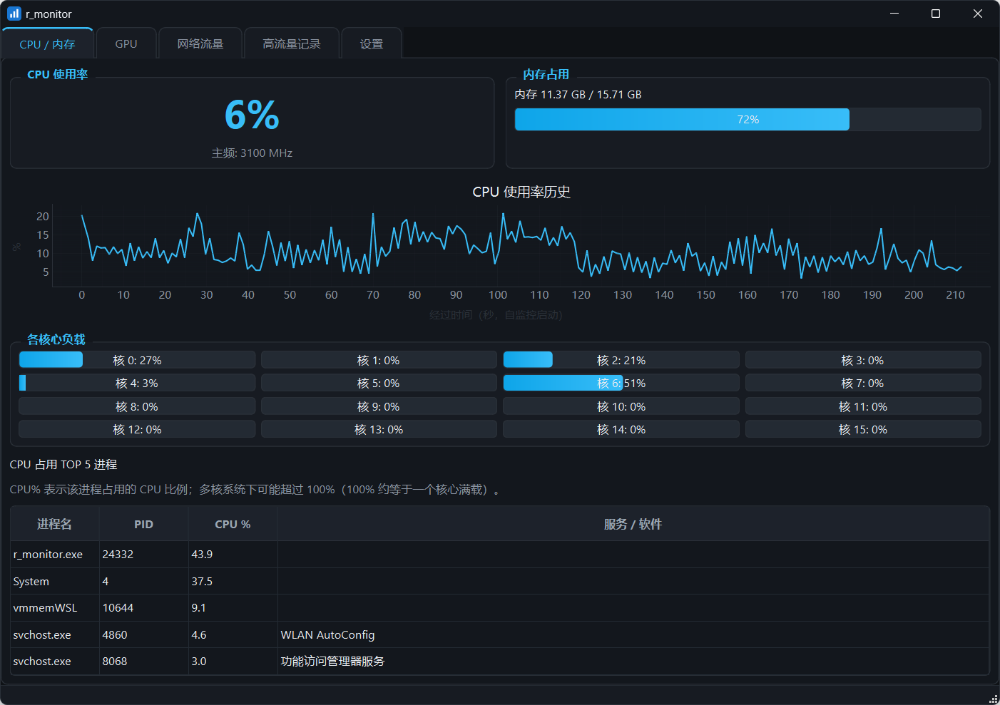

# r_monitor

Windows 桌面系统监控工具：实时读取 **CPU / GPU 负载**，并记录**消耗高流量的上传、下载进程**。




## 功能

- **CPU / 内存**：整体与每核使用率、主频、内存占用、CPU TOP 进程（基于 `psutil`）。
- **GPU**：跨厂商（NVIDIA / AMD / Intel）的利用率、专用/共享显存占用（基于 Windows 自带
  DXGI + PDH 性能计数器，无需安装任何厂商 SDK）。
- **网络流量**：
  - 全局上传/下载实时速率（基于 `psutil.net_io_counters`）。
  - 每进程 TCP + UDP 上下行字节（见下方「每进程字节的三种数据源」）。
  - 超过阈值的进程自动记录到本地 SQLite（「高流量记录」页），并附带其连到的远端
    IP:端口，便于排查流量去向。
- **图表**：CPU / GPU / 网络速率历史曲线（`pyqtgraph`）。
- **系统托盘**：关闭窗口最小化到托盘常驻，双击托盘图标恢复。
- **单实例**：重复启动时提示并退出，避免重复采样、重复写库与多个托盘图标。
- **开机自启**：设置页一键开关（写入当前用户 Run 键，无需管理员）。
- **提权重启**：设置页一键「以管理员身份重启」。

## 技术栈

PySide6 + psutil + pyqtgraph + SQLite + IP Helper / DXGI / PDH（纯 Python + Windows 系统 DLL）。

## 安装与运行

```powershell
# 1. 创建虚拟环境并安装依赖
python -m venv .venv
.\.venv\Scripts\python.exe -m pip install -r requirements.txt

# 1.1 可选：如需 npcap 抓包（每进程 TCP+UDP 字节），额外安装 scapy
.\.venv\Scripts\python.exe -m pip install "scapy>=2.5"

# 2. 运行
.\.venv\Scripts\python.exe main.py
```

## 打包为桌面程序（Windows）

使用 PyInstaller 打包成单目录（onedir）版，并包含 scapy（支持 npcap 抓包）。

```powershell
# 在项目根目录执行
powershell -ExecutionPolicy Bypass -File .\build.ps1
```

等价的手动命令（使用 `r_monitor.spec` 配置，会自动裁剪未用到的 Qt 模块以减小体积）。
手动打包前需先确保 `assets\app.ico`（由 `tools\generate_icon.py` 生成）与
`version_info.txt`（由 `tools\generate_version_info.py` 生成）已存在；`build.ps1` 会自动生成二者：

```powershell
python -m pip install pyinstaller
# 先重新生成 exe 版本资源
python tools\generate_version_info.py
python -m PyInstaller --noconfirm --clean r_monitor.spec
```

产物位于 `dist\r_monitor\`，主程序为 `r_monitor.exe`。

说明：

- 打包为**无控制台窗口**（windowed）的 GUI 程序。
- `r_monitor.spec` 完整打包 scapy 子模块（保证 npcap 抓包能解析各类网络包），并剔除本程序用不到的 Qt 模块（Quick/Qml/Pdf/Network/Svg/Test、软件 OpenGL 渲染器等），体积约 115 MB。
- 打包后「提权重启」与「开机自启」会自动适配 exe 形态（`system.py` 已处理 frozen 模式）。
- 若想进一步减小体积且不需要 npcap 抓包，可删除 spec 中 `collect_submodules("scapy")` 一行（scapy 为可选依赖，缺失时自动降级为 TCP ESTATS / 连接数）。
- 单文件（onefile）版：去掉 spec 末尾的 `COLLECT(...)` 并把 `EXE` 改为单文件模式（启动较慢、杀软误报概率更高）。

## 每进程字节的三种数据源

程序按优先级自动选择，并在「网络流量」页与「设置」页给出提示：

| 数据源                      | 覆盖      | 要求                                                                                    |
| --------------------------- | --------- | --------------------------------------------------------------------------------------- |
| **npcap 抓包**（scapy）     | TCP + UDP | 安装 [npcap](https://npcap.com/)（免费），抓包需管理员（或 npcap 配置为非管理员可抓包） |
| **TCP ESTATS**（IP Helper） | 仅 TCP    | 以管理员身份运行（无需额外软件）                                                        |
| 连接数（降级）              | 无字节    | 无需任何条件，仅按连接数排序                                                            |

> Windows 未提供免驱动的「每进程字节」接口，这是系统固有限制：
>
> - 想要 **TCP + UDP 都精确** → 安装 npcap；
> - 只要 **TCP 精确** → 以管理员运行即可（设置页有「以管理员身份重启」按钮）。

## 目录结构

```
r_monitor/
├── main.py                  # 入口（转发到 r_monitor/cli.py）
├── pyproject.toml           # 项目元数据 + ruff/mypy/pytest 配置
├── requirements.txt         # 运行时依赖
├── requirements-dev.txt     # 开发/构建工具（pytest/ruff/mypy/pyinstaller）
├── r_monitor.spec           # PyInstaller 打包配置
├── version_info.txt         # exe 版本资源（tools/generate_version_info.py 生成，勿手改）
├── smoke_test.py            # 采集器冒烟测试（无 GUI）
├── estats_diag.py           # TCP ESTATS 诊断脚本
├── assets/app.ico           # 生成的应用图标（tools/generate_icon.py 生成）
├── tools/
│   ├── generate_icon.py          # 纯标准库生成 .ico 图标
│   └── generate_version_info.py  # 生成 exe 版本资源 version_info.txt
├── tests/                   # pytest 单元测试
└── r_monitor/
    ├── cli.py               # 命令行入口（r-monitor / python -m r_monitor.cli）
    ├── config.py            # 配置与设置持久化（Settings dataclass + SettingsStore）
    ├── models.py            # 采样数据模型（dataclass）
    ├── storage.py           # SQLite 存储
    ├── monitor.py           # 采样线程（QThread + 信号）
    ├── system.py            # 管理员检测 / 提权重启 / 开机自启
    ├── single_instance.py   # 单实例锁（QLockFile）
    ├── winsvc.py            # 进程归属（服务名 / 软件名）解析
    ├── logging_setup.py     # 日志初始化（文件 + 控制台轮转）
    ├── collectors/
    │   ├── base.py          # 采集器抽象基类
    │   ├── cpu.py           # CPU/内存
    │   ├── gpu.py           # GPU（DXGI + PDH）
    │   ├── network.py       # 网络（psutil + IP Helper + 抓包）
    │   ├── sniffer.py       # npcap 抓包（scapy，可选）
    │   └── estats.py        # IP Helper 表枚举 + TCP ESTATS（共享）
    └── ui/
        ├── main_window.py   # 主窗口 + 系统托盘
        ├── cpu_widget.py
        ├── gpu_widget.py
        ├── network_widget.py
        ├── history_widget.py
        ├── settings_widget.py
        ├── floating_window.py  # 置顶悬浮窗
        ├── theme.py         # 亮/暗主题
        └── common.py        # 图表/格式化工具
```

## 开发

```powershell
# 安装运行时 + 开发依赖
pip install -r requirements.txt -r requirements-dev.txt

# 单元测试
pytest -q

# 静态检查 / 类型检查
ruff check r_monitor tests tools main.py smoke_test.py estats_diag.py
mypy r_monitor

# 生成应用图标（打包前 build.ps1 会自动调用）
python tools\generate_icon.py
```

## 设置

「设置」页可调整采样间隔、告警阈值、图表点数、进程榜条数，并管理开机自启与提权重启；
配置保存在 `~/.r_monitor/settings.json`，高流量记录保存在 `~/.r_monitor/r_monitor.db`；
运行日志保存在 `~/.r_monitor/r_monitor.log`（按 2 MB × 3 轮转）。
